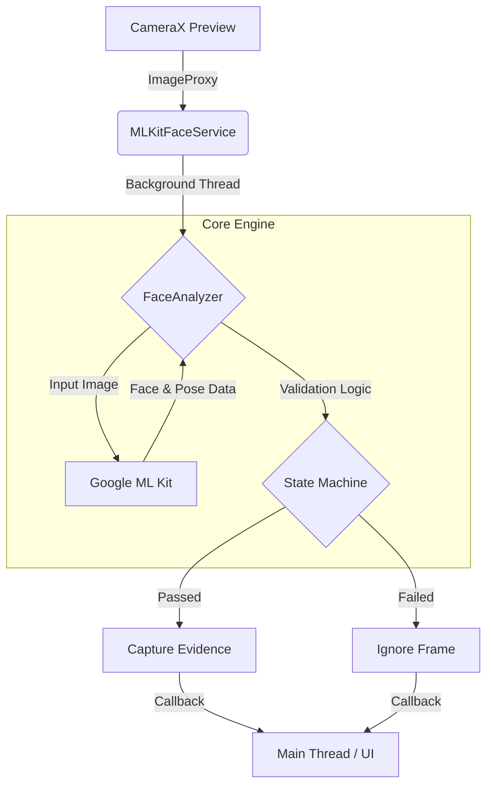

# 📸 Android Liveness Detection SDK

<p align="center">
  <!-- Ganti dengan demo GIF lo -->
  
</p>

**Simple, Configurable, and Lightweight Liveness Detection for Android**  
Built on top of **Google ML Kit** and **CameraX**, designed for real-world verification use cases.


---

## ✨ Features

- **Configurable Verification Steps**  
  Define custom liveness flow (Look Left → Look Right → Smile → Blink).

- **Audit Mode Support**  
  Capture evidence for each step or only final selfie.

- **State Machine Enforcement**  
  Users cannot skip or reorder steps.

- **Privacy First (Offline Processing)**  
  All face analysis happens on-device. No cloud dependency.

- **Clean & Minimal API**  
  Simple integration using `LivenessFactory` and `LivenessConfig`.

---

## 🏗️ Architecture & Tech Stack

This SDK uses a **state-driven, background-threaded architecture** to ensure smooth UI performance and strict verification order.

### Core Technologies

- **CameraX** – Camera lifecycle & preview handling  
- **Google ML Kit** – Face detection & landmark analysis  
- **ExecutorService** – Background processing (non-blocking UI)  
- **State Machine** – Enforces sequential liveness steps  

### Data Flow Diagram



---

## 🛠 Installation

### Option 1: Git Submodule (Recommended)

```bash
git submodule add https://github.com/nunutech40/android-liveness-sdk.git liveness-sdk
```

Add module to `settings.gradle`:
```groovy
include ':liveness-sdk'
```

Add dependency to app `build.gradle`:
```groovy
dependencies {
    implementation project(':liveness-sdk')
    implementation "androidx.camera:camera-view:1.3.0"
}
```

---

## 🚀 Quick Start

### 1. Permission Setup

```xml
<uses-permission android:name="android.permission.CAMERA" />
<uses-feature
    android:name="android.hardware.camera"
    android:required="true" />
```

---

### 2. Layout Setup

```xml
<androidx.camera.view.PreviewView
    android:id="@+id/cameraPreview"
    android:layout_width="match_parent"
    android:layout_height="match_parent" />
```

---

### 3. Basic Usage

```kotlin
val config = LivenessConfig(
    steps = listOf(
        LivenessStep.LOOK_LEFT,
        LivenessStep.LOOK_RIGHT,
        LivenessStep.SMILE
    ),
    isAuditMode = false
)

val detector = LivenessFactory.create(context)

detector.bind(
    lifecycleOwner = this,
    previewView = cameraPreview
)

detector.startDetection(
    config = config,
    onStepSuccess = { step ->
        // Update instruction UI
    },
    onStepError = { error ->
        // Handle detection error
    },
    onComplete = { result ->
        if (result.isSuccess) {
            val selfie = result.totalBitmap
            // Upload or process selfie
        }
    }
)
```

---

## ⚙️ Configuration

### `LivenessConfig`

| Parameter | Type | Description |
|--------|------|-------------|
| `steps` | `List<LivenessStep>` | Ordered verification steps |
| `isAuditMode` | `Boolean` | `false`: final photo only<br>`true`: capture every step |

---

### `LivenessStep`

| Step | Description |
|-----|------------|
| `LOOK_LEFT` | Head rotation > 35° left |
| `LOOK_RIGHT` | Head rotation > 35° right |
| `SMILE` | Smile probability > 0.7 |
| `BLINK` | Both eyes blink detected |

---

### `LivenessResult`

| Property | Type | Description |
|--------|------|-------------|
| `isSuccess` | `Boolean` | All steps passed |
| `totalBitmap` | `Bitmap?` | Final selfie |
| `stepEvidence` | `Map<LivenessStep, Bitmap>` | Audit mode evidence |
| `error` | `LivenessError?` | Failure reason |

---

## 📱 Requirements

- **Min SDK**: 24 (Android 7.0)
- **Java Version**: 11
- **Camera Permission** granted

---

## 🔒 Privacy & Security

- **Offline Processing**  
  All face detection and liveness checks run fully on-device.

- **No Cloud Upload**  
  This SDK does **not** collect, store, or transmit facial data.

- **Developer-Controlled Data**  
  Final Bitmap results are returned directly to the host app.

---

## 🤝 Contributing

Pull Requests are welcome.

- Core logic: `internal/FaceAnalyzer.kt`
- Public API: `api` package

---

## 📄 License

```text
Copyright 2025 Komerce

Licensed under the Apache License, Version 2.0 (the "License");
you may not use this file except in compliance with the License.
You may obtain a copy of the License at

    http://www.apache.org/licenses/LICENSE-2.0
```
